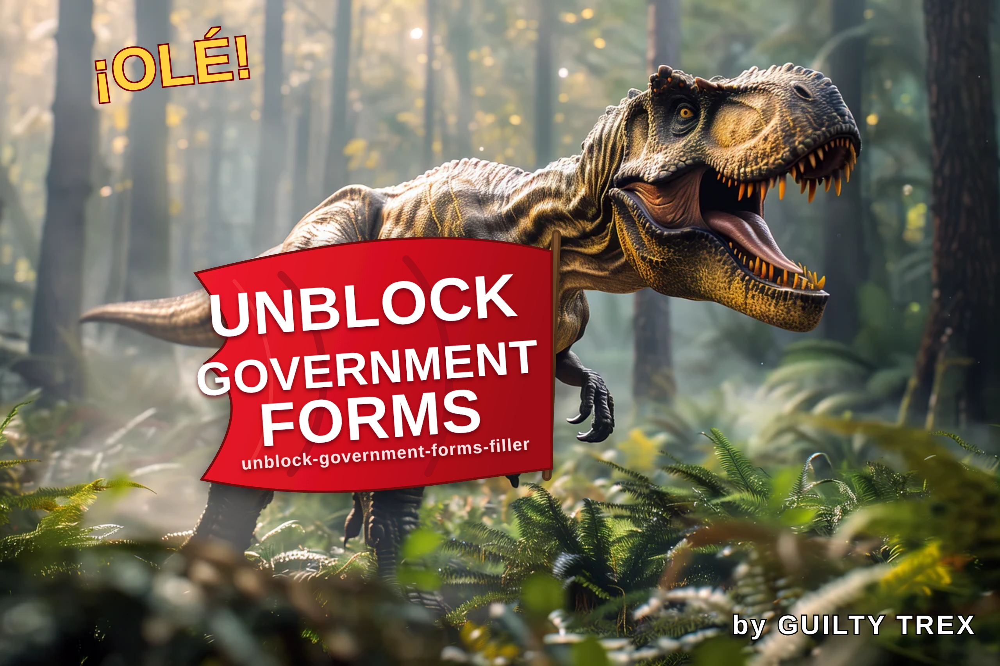
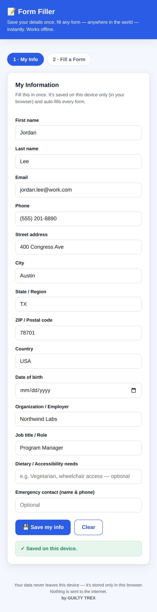
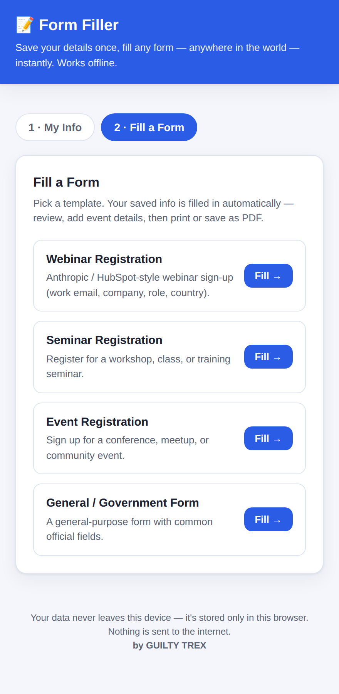
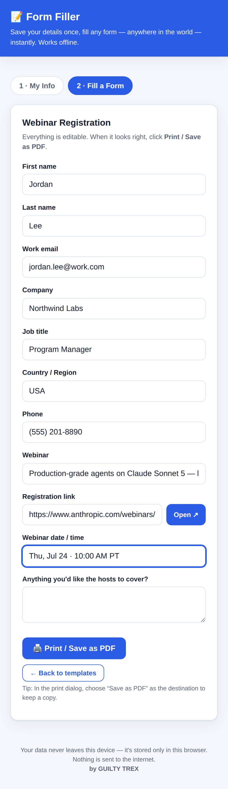
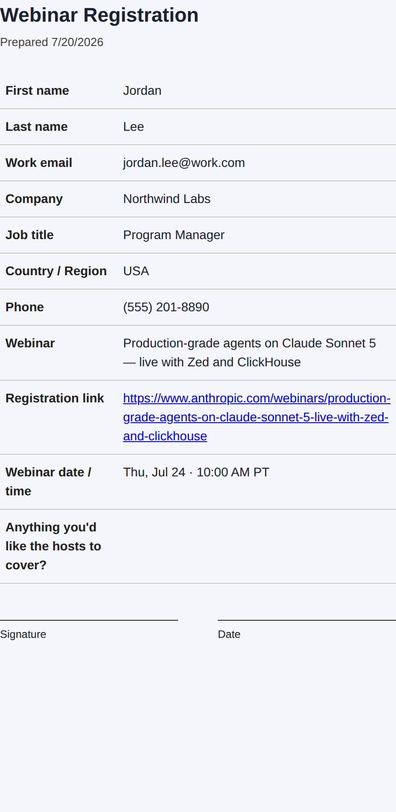

# 📝 Unblock Government Forms — Form Filler

**Fill out any form — anywhere in the world — in seconds, even when your browser's autofill isn't working.**

*by **GUILTY TREX***

<p align="center">
  
</p>

Save your details once, and this app drops them into ready-made forms with a single
tap. Review, then print or save as PDF. It's **one HTML file** — no install, no
accounts, no internet required, and nothing about you ever leaves your device.

> Built as a simple, reliable way to get through when a form is being blocked for you.

---

## 🌍 Works with any form, anywhere in the world

Wherever you are and whatever you're being kept out of, this app helps you fill it
out and keep your own copy:

- **🏛️ Government — unblocked.** Permits, applications, official and civic forms.
- **💼 Business — unblocked.** Registrations, vendor forms, sign-ups, applications.
- **🎓 College — unblocked.** Admissions, enrollment, financial aid, event forms.
- **🌐 Any website — unblocked.** If a form is stopping you, this gets you through.

The templates are just starting points — every field is editable, so it works with
**any form, in any country.**

---

## 💬 Why this exists — a note from the founder

I built this because I was being blocked.

As a **political candidate**, I have personally experienced having my ability to
participate online interfered with — being unable to complete forms, register for
events, and take part in things that should be open to everyone. That experience
convinced me I am not alone. I believe **founders, business owners, and everyday
residents** run into the same walls: forms that won't submit, sign-ups that quietly
fail, access that gets cut off.

My concern is simple: when people hold privileged, back-end access to the systems we
all rely on, that access can be misused to interfere with someone's ability to take
part in public life. **This application is a direct, constructive response to that.**

Form Filler makes sure that if a form or sign-up is being blocked for you, you still
have a reliable, offline way to **capture your information, complete the form, and
keep a copy** — on your own device, under your own control, with nothing sent to
anyone. It's about giving people back access and participation.

**This is the first public release.** It's the beginning, not the end — I'm going to
keep building tools that help people use websites and complete the things they're
being kept out of. A **second part is coming**. If this helps even one person get
un-blocked, it's worth it.

If this resonates with you, use it and share it — the whole point is that everyone
can connect and get through.

> *Read the full mission in [MISSION.md](MISSION.md).*

### 🔗 Connect with the founder

- **Website:** [victormiamidadecountymayor.com](https://victormiamidadecountymayor.com)

---

## 📸 What it looks like

| Save your info once | Pick a form | Auto-filled & ready |
|:---:|:---:|:---:|
|  |  |  |

Then print or save a clean PDF:

<p align="center">
  
</p>

---

## ✨ Features

- **Save your info once** — name, email, address, phone, company, role, and more,
  stored only in your own browser on your own device.
- **One-tap auto-fill** into four ready-made templates (see below).
- **Registration link built in** — save the sign-up page URL on the form and tap
  **Open ↗** to jump straight to the real registration page. The link is also
  clickable on the saved PDF.
- **Print / Save as PDF** — clean, printable output with a signature line, ready
  to keep, print, or email.
- **Works fully offline** — no internet connection required, ever.
- **Mobile-friendly** — use it on your phone and add it to your home screen like an app.
- **Private by design** — no tracking, no accounts, no server. See [Privacy](#-privacy).

---

## 🚀 Quick start

1. **Open the app** — [online with no download](#-two-ways-to-use-it--your-choice-always),
   or download [`index.html`](index.html) and open it in any browser.
2. **My Info** — enter your details once and tap **Save my info**.
3. **Fill a Form** — pick a template. Your saved details fill in automatically.
4. Add the event-specific details (event name, date, session), then tap
   **Print / Save as PDF**. Choose *Save as PDF* in the print dialog to keep a copy.

> **Good to know:** Form Filler produces a filled, printable copy of your
> registration. It doesn't submit to an organization's website for you — use the
> **Open ↗** button to go to the real form, then fill it in quickly from your saved
> details (or bring the printed PDF along).

---

## 📋 The four templates

| Template | Best for | Notable fields |
|---|---|---|
| **Webinar Registration** | Online webinars (Anthropic / HubSpot-style) | Work email, company, job title, country, registration link |
| **Seminar Registration** | Workshops, classes, training | Course name, date(s), session/time slot, dietary/accessibility needs |
| **Event Registration** | Conferences, meetups, community events | Event name, date, attendees, ticket type, emergency contact |
| **General / Government Form** | Any official-style form | Date of birth, reference/case number, purpose of request |

Every field is editable, so you can adapt any template to a specific form.

---

## 📥 Two ways to use it — your choice, always

**Repository:** `theequationagency-dev/unblock-government-forms-filler`
👉 https://github.com/theequationagency-dev/unblock-government-forms-filler

### 🌐 Use it online — no download needed
Don't want to download anything? You don't have to. Open it right in your browser:

```
https://raw.githack.com/theequationagency-dev/unblock-government-forms-filler/main/index.html
```

Tap it and it just runs — on your phone or computer. Add it to your home screen and
it opens like an app. Nothing to install, ever.

> **Saving your info:** some phone browsers (especially Safari) block permanent
> saving on a shared web link. You can still fill and print forms right away, but to
> **keep your saved info after closing**, either **download the file** (below) and open
> it, or use your own **GitHub Pages** link. The app will tell you if your browser is
> blocking saving.

### 📄 Or download it — works fully offline
Prefer to keep your own copy? Download [`index.html`](index.html) and open it. Once
it's on your device it works with **no internet at all**.

### ⭐ Optional: your own clean web link (GitHub Pages)
For a permanent link on your own GitHub address, enable it once under
**Settings → Pages → Deploy from a branch → `main` / `root`**. It then goes live at:

```
https://theequationagency-dev.github.io/unblock-government-forms-filler/
```

Either way, the published code contains **no personal data** — your saved info always
stays in your browser, never in the repo.

---

## 🔒 Privacy

- All your information is stored in your browser's **local storage**, on the device
  you use it on.
- The app makes **no network connections** and sends **no data** to any server.
- Because storage is per-device, info saved on your phone stays on your phone —
  just fill **My Info** once on each device you use.
- Clearing your browser data (or tapping **Clear** in the app) removes your saved info.

---

## ❓ FAQ

**Does it submit the form for me?**
No — it fills out and prints/saves a copy of your answers. Use **Open ↗** to reach
the real sign-up page and enter the details there (or bring the PDF).

**Is my data uploaded anywhere?**
No. Everything stays in your browser. The app works with the internet turned off.

**The GitHub Pages link shows a 404 — why?**
Pages has to be turned on first (Settings → Pages), and the repo must be public.
The site appears about a minute after you enable it.

---

## 📂 Project structure

| Path | Purpose |
|---|---|
| `index.html` | The entire app — HTML, CSS, and JavaScript in one self-contained file. |
| `docs/` | Screenshots used in this README. |
| `README.md` | This documentation. |
| `MISSION.md` | Why this project exists and who it's for. |
| `LICENSE` | MIT license. |

---

## 📄 License

Released under the [MIT License](LICENSE) — free to use, modify, and share.
Copyright © 2026 The Equation Agency LLC — Aventura, Florida.

---

<p align="center">
  <strong>Made in Miami-Dade County with ❤️</strong><br>
  by Candidate <strong>Victor J. Rosario</strong> 🏖️<br>
  <em>Expert in Digital Strategy, SEO, Network Engineering &amp; Development</em>
</p>
